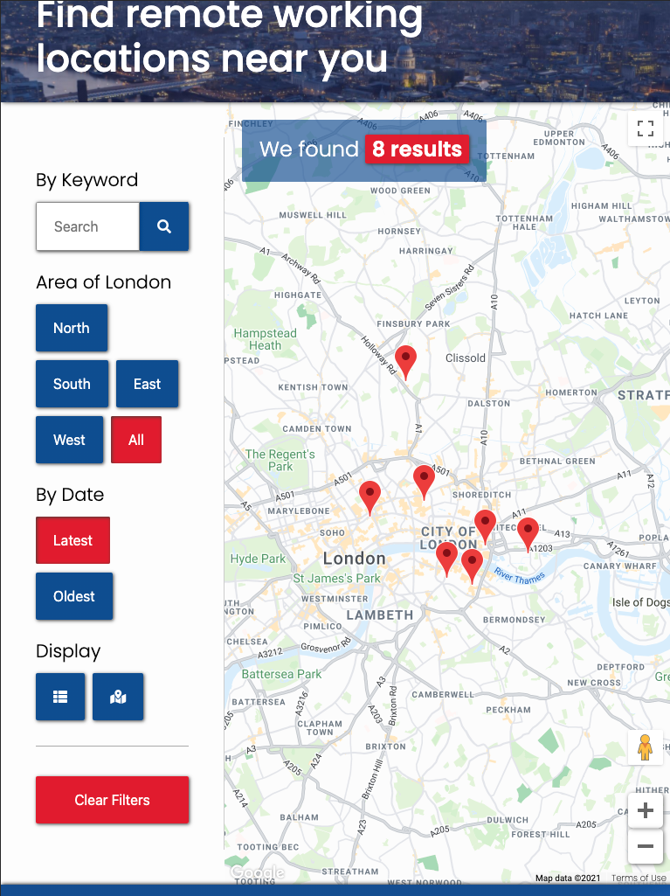

# Remote London

  

## About this Site

This site will provide users with a directory of local listings in which users can visit and work from remotely.

The site is primarily designed for those users who either as Freelancers, need a working environment they can meet with colleagues and clients, or for those working from home full-time since lockdown during the pandemic, need a suitable place to work for the day with spaces to make calls.

[View the live site here](https://bradleyhc.github.io/MS2-remoteworking-london/)

## Contents

### [User Experience (UX)](#user-experience-ux)
- [User Stories](#user-stories)   
- [Design](#design)
- [Typography](#typography)
- [Colours](#colours)
- [Imagery](#imagery)
- [Wireframes](#wireframes)

> continue

---

 

## User Experience (UX)
The primary purpose of this site is to quickly provide users with information that they are likely to use in conjunction with wider research. Since this site will likely be one of many similar sites they visit, the user needs to quickly learn what content the site provides and convince them that reading further is worth their attention.

In order to achieve this, the site is built with simplicity in mind - a simple landing page that clearly sets out the purpose, followed by a single directory listing page, that also allows the user to chose how they view (via list or map) and quickly search for and filter listings that are most relevant to them (through keyword search and area and tag filters) 

### User Stories
 
- #### First time visitors
    - As a first time visitor, I want to quickly decide whether spending more time on this site will be worthwhile in answering my needs.
    - I am only interested in listings that are within suitable distance to me.
    - I will likely use the content from this site and others to form a decision on the best location to visit, so my time on this site will be limited.
- #### Returning visitors
    - As a returning visitor, I have already seen the content from the site on the initial visit - I am only looking for new listings.
    - Part of the reason I am returning may be to give feedback on a listing after visiting their location.
- #### Freelancers who work irregular or part time hours
    - As a Freelancer, my day will likely be split between multiple projects and clients. I don't always need a location to work from for a full day, so I want to see listings that do not require a full day booking.
    - I am looking for locations that will allow me to meet clients and collaborate for a few hours at a time.

- #### A full time employee who cannot work from home comfortably
    - As a full time employee working from home due to the pandemic, I am solely interested in listings that I know I can work from for the full day. 
    - I want to see only the listings that will have quiet places I can make calls with a good internet connection
- #### Location owners
    - As someone who owns a location users can work remotely from, I want to add my listing to the site with ease in order to promote my business.
    - I want to see what other listings are offering in order to learn more about the site users and tailor my listing content accordingly. 
- #### Site owner
    - As the site owner, I want to ensure that information is accurate and user feedback is received, to improve value to the user.
    - I want users to share the site content with others to drive traffic to site.

 

### **Design**
The overall design for the Remote London uses a clear, clean layout with ease of use in mind - bold header areas with a clear directory listing area and contact form.

#### Typography
The Google Font "Poppins" is used as an easy to read, sans-serif font that compliments the contemporary, straight lines of the layout and design. It's heavier weight is impactful and quickly grabs the users eye when used as headings.

#### Colours
Colours on Remote London have been selected based on the initial emotional response a user can be expected to have, according to color theory guides such as <a href="https://userpeek.com/blog/what-is-color-psychology-in-ux/" target="_blank">User Peek</a>.
- The blue footer, overlay on headers and accent within the body evokes a feeling of stability and confidence
- The lighter, slightly pastel orange with the accompanying pastel teal promotes a feeling of inspiration and creativity, but without the agression that can often be felt with darker, warmer colours. 

#### Imagery
Images within the primary site body are used to compliment the colour palette in the rest of the site, whilst also clearly identifying to the user what the site is about. Examples of this include: 
- The header on the home page shows a cityscape of London, clearly focussing user attention on London as the core reason for the site. The darker blue gradient overlay on the top of the image is used to both improve visibility of the the navbar, but also introduce the blue colour accent at the earliest opportunity.
- The header on the location listing page shows again a cityscape of London, but with a warmer tone, complimenting the pastel orange colours on the rest of the site.

 

### **Wireframes**
- View the [Desktop wireframe here](./documentation/wireframes/wireframes-desktop.pdf).
- View the [Tablet wireframe here](./documentation/wireframes/wireframes-tablet.pdf).
- View the [Mobile wireframe here](./documentation/wireframes/wireframes-mobile.pdf).

 

---

 

## **Features**
- Location Search from homepage - this feature allows users to search the directory from the homepage by entering a search query in the text input in the header section. Submitting the search query will return all results on the 'Location' page where the query matches any string of text within the name, or content of the listing.
- Most recent listings on homepage - this feature enables users to quickly see if there are new listings on the site, but viewing the 'Our Latest Additions' section on the homepage.
- Instant listing filter without page load - as the data is loaded into the page when the DOM is loaded, the listings are filtered by hiding and unhiding results based on criteria, versus triggering a new HTTP request each time, requiring a page reload. The additional information from Google is only called when a user clicks on 'read more' on a listing, allowing more listings to be shown, whilst remaining under the 5 result limit that Google imposes.
- Filter listings by area of London - on the 'Locations' page, users are able to filter the listings based on the area of london. By simply clicking one of the area buttons, the results will immediately hide all results that do not meet the criteria.
- Filter listings by most recent or oldest posts - users can sort the listings on the 'Locations' page by clicking 'Latest' or 'Oldest' in the filter section.
- Display listings in a list view or map view - Users can select how they wish to view the listings by clicking either the list or map icon buttons at the bottom of the filter section. On hover, a tooltip provides guidance on what the buttons do.
- View and filter listing markers on map - the above filters are available to users on the map view also, with the markers hidden and unhidden based on the search criteria. If the user enters a text search query, the view will default back to the list view to show more detailed information.
- On the 'more info' sidebar, users can view Google reviews of locations and click button to view location in google maps.
- The site is responsive on all devices from mobile to desktop. See the [Responsiveness](#responsiveness) testing section below. 

### **Features to add in future releases**
- Social sharing of each listing to social media sites.
- User rating system for each listing based on criteria (rating for coffee quality, cost, atmosphere etc).
- User frontend submission of listing with admin moderation. 
- User testimonials on listings. 

 

---

 

## **Technologies & Tools Used**
The core codebase for the Remote London website is created using HTML5, CSS3 and Javascript. In addition to these core languages, a number of frameworks, libraries and APIs were used to create the initial release. A full list of these are shown below:
- [HTML5](https://html.spec.whatwg.org/multipage/) - is used as the core language to create the Document Object Model (DOM).
- [CSS3](https://www.w3.org/Style/CSS/specs.en.html) - is used to style the HTML elements. 
- [Javascript](https://www.javascript.com/) - is used to manipulate the DOM elements and change styling based on a number of functions in the site.
- [jQuery](https://jquery.com/) - library is used to extend the vanilla Javascript functionality and efficiently manipulate DOM elements both with IIFE functions and function declarations.
- [Google Places API](https://cloud.google.com/maps-platform/places) - has been used to pull place information from Google using the place ID, into the 'request' dataset, which generates the objects for the listings loop.
- [EmailJS](https://emailjs.com) - used as an API to send an email from the contact form on 'Contact' page and return an auto-reply to the user.
- [Bootstrap](https://getbootstrap.com/) - a frontend framework used to create the base for styling the layout and elements on the page.
- [GitHub](https://github.com) - used to for code version control and hosting. 
- [GitHub Pages](https://pages.github.com/) - used to deploy to a production environment accessible by users.
- [GitPod](https://gitpod.io/) - browser based code editor used to write, edit and commit code directly to GitHub. 
- [Tiny PNG](https://tinypng.com/) - an image lossless compression tool used to reduce the site image assets.
- [Balsamiq](https://balsamiq.com) - a wireframe creator used to create the mobile, desktop and tablet wireframes in the section above.
- [CSS Gradient](https://cssgradient.io) - a tool used to create the background colour gradients found on the site, such as the header, footer and buttons.
- [Chrome Dev Tools](https://developers.google.com/web/tools/chrome-devtools) - used for debugging of JS, CSS and HTML.
- [Jigsaw W3 Validator](https://jigsaw.w3.org/css-validator/) - CSS validation tool used to test quality of CSS code.
- [W3 HTML Validator](https://validator.w3.org/) - used to validate and check quality of HTML on site.
- [JS Hint](https://jshint.com/) 
- [Am I Responsive](http://ami.responsivedesign.is/) - used to generate site images showing various devices at within this README.md
> need to add js hint

 

---

 

## **Testing**

### **Code Validation**
To ensure accessibility by all modern browsers and differing devices and users, the Remote London website has been validated on W3C HTML, W3 Jigsaw CSS and JS Hint validators. Whilst the initial codebase passed validation, the third party libraries such as FontAwesome and Bootstrap have presented common errors and warnings. See further details below:
- ### W3C HTML Results
    - 
- ### W3 CSS Results
    - 
- ### JS Hint Results
    - 
    

> insert screenshot here!

### **User Story Testing**

- #### First time visitors
    - As a first time visitor, I want to quickly decide whether spending more time on this site will be worthwhile in answering my needs.
        - This is accomplished by the immediate indication on the index.html page what the site content is about with the headline 'Find remote working locations near you' and the background image of London.
        - This, coupled with the brand logo 'Remote London' clearly signifies that this site has been created to show information on where to work.
        
    - I am only interested in listings that are within suitable distance to me.
        - The site currently clearly states that the listings will cover the London area only. 
        - Whilst not yet on the site, future releases will include geolocation of the user and the ability to filter locations based on the distance from the user.
        - Users can filter the listings that are shown on the locations page by clicking one of the five 'area buttons'. 
            - Clicking on North, South, East or West will only return results that have those values in the 'area-tag' div.
             
    
    - I will likely use the content from this site and others to form a decision on the best location to visit, so my time on this site will be limited.
        - The site clearly pushes users to a single listings page through 'call to action' search inputs and listing cards on the homepage. 
        - Once on the listings page, information is clearly laid out and easy to read. The user is able to quickly see which listings might be worth looking into, and more information can be found by clicking on the 'view website' button on the more information sidebar.
        
- #### Returning visitors   
    - As a returning visitor, I have already seen the content from the site on the initial visit - I am only looking for new listings.
        - The listings page allows the user to sort the listings by date they were posted to the site. This will enable returning visitors to quickly see what has been posted recently since they were last on the site.
        - The homepage also clearly outlines the most recent additions in the second section, below the fold. A returning visitor would quickly be able to see if there are new listings by comparing these listing cards to those that were shown on their last visit.
        
    - Part of the reason I am returning may be to give feedback on a listing after visiting their location.
        - The user can easily navigate to the 'contact' page and submit a quick message to the site owner. Form validation is in place to prevent spam messaging from automated bots.
            - The form can be tested by entering numerical information in the 'first name' and 'last name' fields. On submit, the form should prevent posting and return an error notice to users.
            - The email field validation can also be tested by entering a string without an '@' symbol. If the user clicks 'submit' the form will not post and return field validation error to the user.
            - The subject, message and terms fields are also set to required. This can be tested by attempting to submit the form without these fields completed. The form will not submit and return a 'field' required error to the user.
            - Once the 'first/last name' fields contains only alpha characters and the email field contains the '@' symbol, the form will successfully submit, showing the 'thank you' page.
           

            
            
             
            

        - On submitting the form, the user will receive and automated email reply acknowledging receipt of the message.
        - The user will also be directed to a 'thank you' page on successful submission to acknowledge that the site has sent the message, and then clearly direct the user back to the homepage through a call-to-action button.

         
        

- #### Freelancers who work irregular or part time hours
    - As a Freelancer, my day will likely be split between multiple projects and clients. I don't always need a location to work from for a full day, so I want to see listings that do not require a full day booking.
        - This user story can be tested by entering the keyword "Hourly booking". The search function successfully returns only those results that have the tag "Hourly Booking". 
        - This user story can also be tested by viewing the 'more details' section of these listings. The additional information states that hourly booking is available and the cost for this.
        
        
        
    
    - I am looking for locations that will allow me to meet clients and collaborate for a few hours at a time.
        - As with hourly booking, the above story can be tested by using the 'search by keyword' function. The below image shows that a keyword search of 'co-working' returns all results where a tag or listing information contains the string 'co-working'.
        
        

- #### A full time employee who cannot work from home comfortably
    - As a full time employee working from home due to the pandemic, I am solely interested in listings that I know I can work from for the full day. 
        - This user story can be tested by using the keyword search. If the user enters the keyword 'Daily booking', all results that allow the user to work from for the day will be returned.
        - The user can verify each of these listings by clicking on 'read more' or the listing card and reviewing the additional information.
        
        
        

    - I want to see only the listings that will have quiet places I can make calls with a good internet connection
        - As with the above user story tests, this story is tested by entering the keyword 'meeting rooms' into the search field will return all listings that provide meeting rooms or phone-booths that will allow users to make quiet calls.

        
        

- #### Location owners
    - As someone who owns a location users can work remotely from, I want to add my listing to the site with ease in order to promote my business.
        - This can be accomplished by the user by going to the contact page and completing the form.
        - The fields are mandatory and require the user to enter their name, message, subject and email so that we can contact them regarding the message.
        - The user is also required to confirm that they are happy to the site owner contacting them to discuss the message. 
        - If these fields are not completed, the form will fail validation and call out the errors to the user.
        - If the user completes the form successfully, the page will redirect to the 'thank you' page and an auto-reply email will be sent to the user, using the EmailJS API.
        - See the form validation flow screenshots in the ['user feedback' testing above](#form-flow)
    - I want to see what other listings are offering in order to learn more about the site users and tailor my listing content accordingly. 
        - The user can see this from the other listings on the 'Locations' page.
        - The user can see where the listing is located by clicking the 'map' filter, and read more information on what the listing offers by clicking the info window and enclosed call-to-action button.
        
        
        

- #### Site owner
    - As the site owner, I want to ensure that information is accurate and user feedback is received, to improve value to the user.
        - As site owner, I can collect user feedback from the 'contact' page. The copy above the form clearly states what the form is to be used for; "Have a new listing to share, or feedback for an existing one?", prompting the user to focus their message on topics such as this.
        

### **Lighthouse Testing**
> add lighthouse testing screens

### **Responsiveness**
Remote London is fully responsive on all device sizes. Using the Bootstrap breakpoints as the primary differentiator, the key differences are outlined below:
- Hamburger menu on navigation:
    - On mobile, the default navigation menu items are hidden by default, and revealed upon the click on the hamburger nav icon. 
    - Clicking the icon smoothly pushes the remainder of the page down and reveals the menu items. This ensures the users do not have to scroll more than necessary to get to the content of the page and thus improves useability.
    - On tablet and desktop, the nav items are clearly located at the top right of the page, where users are accustomed to seeing navigation menus.
    
     
     
     
    

- Filter section on locations.html page:
    - On mobile, the filter section is collapsed by default using the Bootstrap 'collapse' class and data-toggle.
    - The filter is easily opened by clicking the filter icon or header 'filter'. Having the entire header act as the trigger ensures that the area required to click is larger, and improves useability for users on small mobile devices.
    - With the filter built to be collapsable, this also ensures that the user does not have to uneccessarily scroll to view the listings - they can simply close the filter and quickly see the first result. 
    - On screen sizes medium and above, the filter section is positioned as a sidebar on the page, which reduces the need for the user to scroll, when the screen is wide enough to show both the filter section and the listings with ease.
     
    
     

- More information sidebar on locations.html page:
    - On mobile devices, clicking the 'read more' call-to-action on an listing item will open the more info sidebar full screen, to ensure content is easily readable and as much of the screen real-estate is used, preventing uneccessary scrolling by the user.
    - On tablet devices, the more info sidebar opens as a modal in the center of the screen. The section doesn't require the full height and width of the screen here, but having the sidebar on the right of the page as with desktop, would add unnecessary scrolling for the user to view all of the contents. 
    - On larger screens, the more info sidebar opens as a sidebar from the right, with a dark content overlay over the rest of the page. As with the modal on tablet, the darker background focusses user attention to the new content on the page. 
     
    
     

- Map view on locations.html page:
    - To improve useability on all devices, the map view resizes the map div to the width and height of the screen. 
    - On mobile, the map is set to 100vh and width 100% to ensure the entire map can be visible without the need for page scroll.
    - On tablet and above, the same is true - generating a much wider map, using as much screen real-estate as possible, increasing the area in which users can scroll and use the map functionality.
     
    
     

 

### **Accessibility**
- 'aria-hidden' added to Google Map button and map due to poor accessibility. 
- Initial colour scheme changed slightly to make white on orange contrast improved.
> write

### **Fixed Bugs**
- Google API & Location listing (google_maps_init.js & location_listing.js)
    - Items not filtering by date order 
        - Since the code is written to only pull the data from Google on the initial page load, to increase site performance and reduce data quota, a second Object array is now created after the Google data is pulled.
        - The 'listingObjectsCombined' array combines the listing content, posted date and location to allow for text based search and filtering of date and location based on an active button, with content already existing within the DOM.
        - Following a code review during testing in the final stage of this project, the code was further refactored to use the filter() method to sort Objects using an if/else statement when a button is active, vs a previous structure that created a new array for each area of London ('listingObjectNorth' ... etc).
    - Pagination causing array to sort and filter for only the items shown within that page tab, not based on whole dataset.
        - The initial build was structured prior to the pagination implementation, resulting in the slice() method and subsequent sort() method applied to the array to determine which listings to show on each page, sorting the objects only on the current for loop (i.e Objects 4, 5, 6 were sorted by date, but not 1 - 6). 
        - This bug was fixed by creating a function flow in initList() that each time a sort or filter button was toggled, would clear the previous listings and work through the function to check the criteria based on which buttons were 'active', and unhide the corresponding listing. 
        - Since the data is already pulled from Google and pushed to a new Object array on initial page load, this function now simply hides or unhides listings already loaded into the DOM, making the response time instant.
        - After lots of research on the most effective way to implement this, it was [Tyler Potts](https://www.youtube.com/channel/UCBBGM84ZOs7z5jpTQAaZ_Hg) on YouTube that provided the tutorial that allowed me to fix the above. The pagination tutorial [can be found here](https://www.youtube.com/watch?v=IqYiVHrO2U8).
    - Frequent Google API http request errors on random page loaded
        - This bug caused the 'content' variable within 'initMap()' function to return undefined which resulted in only partial or no return of places data from Google.
        - The error was tested repeatedly whilst changing the script load orders as well as applying async and defer, but the pattern still appeared randomised.
        - After narrowing down the issue to possibly being a result of an inconsistent load time on the Google request, causing location_listing.js to attempt to call data from a script that had not yet run, I decided to use jQuery to append the last script to the <head> tag only after the page had loaded (the answers on [this StackOverflow thread](https://stackoverflow.com/questions/19737031/loading-scripts-after-page-load) guided me on this). 
        - Whilst loading location_listing.js only after the page had loaded helped with the issue, it was still occuring intermittently. Throught further testing, I discovered that the issue is likely caused but the Google API request attempting to run a callback function (initMap()) from a script that may not have loaded at that point. 
        - Having now positioned the Google API request at the bottom of the body, this appears to have dramatically improved this issue, as the initMap() function exists before the script attempts the Google request.
        - Whilst the above fix mitigated this bug the majority of the time, I decided to refactor the code, to now pull the initial data from the 'request' dataset within the codebase, then only call the Google API when 'more details' is clicked. By doing this, the user is only requesting Google information on one result only, making the response time quicker, and ensuring that data will always show.
    - Jumping / flickering of page structure on page load caused by jQuery append() adding items to existing divs that load at different times.
        - This was an expected issue when using javascript to manipulate the HTML on the page, since the scripts would load at different speeds to the HTML in the page. 
        - To fix this issue and improve user experience, I added a loading screen animation with the CSS transform property to continuously run until the full page is loaded where javascript is altering the HTML (index.html and locations.html).
    - Map and list overlay when opening sidebar would remain / disappear early if too many clicks
        - The overlays that appear behind the 'more info' sidebar would frequently become out of sync with the sidebar as their styles were adjusted independently from one another.
        - I have since refactored the code and used jQuery's existing fadeOut() method to show and hide a page-wide overlay, which functions much smoother.
    - Safari would not load initMap in Google callback in script load order specified, resulting in empty dataset
        - In refactoring the code to only reuqest the Google data when the user clicks 'more details', this ensures that the callback function in the Google API is not required to successfully show the initial listing data.
    > rewrite above

- Deployment & Site-wide
    - Footer not sticking to bottom of page when content height in body is less than 100vh
        - The bug was first discovered on the 'About Us' supporting page, whereby only a small paragraph of text existed, the footer would sit at the bottom of the last div.
        - This has now been remedied by creating a footer-wrapper, to which the footer tag can have an absolute position, relative to the wrapper.
        - The wrapper is then set to have a min-height of the footer, and a margin-top of auto to push the wrapper to the bottom of the body (which has a min-height of 100vh))
    - Broken image file path when deploying to GitHub Pages
        - This bug has been quickly fixed by correcting the extra '.' in the root file path in links. Images now direct to './' not '../' which has resolved the issue.
    - Search function on homepage header returns 404 instead of locations page
        - This has now been fixed, again this was due to an incorrect file path when deploying to GitHub Pages.
        - Since I was using window.location.href to set the new path, it was not including the host to the URL string (removing 'MS2-remoteworking-london'), which would return an invalid URL.
        - This bug was fixed with the help of [this article at CSS Tricks](https://css-tricks.com/snippets/javascript/get-url-and-url-parts-in-javascript/)
    - Click to scroll to top button not functioning
        - After many iterations of code to create scroll to top function using jQuery, I discovered through [this thread in StackOverflow](https://stackoverflow.com/questions/1144805/scroll-to-the-top-of-the-page-using-javascript), that the DOM must be loaded before the jQuery scrollTop() method will work. 

### **Known Bugs**
- Currently there is an existing limitation present on the site caused by pulling data from the Google Places API. If a user makes too many requests in a single session, the request will return no, or only partial results. Whilst a fix is being researched, this appears to be a Google quota limitation to avoid overloading the server with requests.
- Images on listings show alt for a few seconds when pulling data.
- On 'more details' trigger on map view, the initMap function reloads the map, making it dissappear for a few seconds
> re-write below

 

---

 

## **Deployment**

### **Version Control: GitHub & GitPod**

The Remote London website has been built using a [GitHub](https://github.com) Repository (MS2-remoteworking-london), with the code written, edited and pushed from [GitPod.io](https://gitpod.io), using the extension available within GitHub.

### **Deploying to GitHub Pages**
The site has been deployed to a production environment using GitHub Pages. Hosting the site on GitHub Pages ensures that a new deployment is available from the same Repository that the GitPod code commits are pushed to. This means that updates to the live site are quick to take affect after each push.

To deploy to GitHub Pages, the below steps were taken and can be followed to repeat deployment: 
- Repository is created within GitHub and made publicly visible.
- With the GitPod extension already installed within GitHub, the codebase is opened within GitPod using the green 'GitPod' button. 
- GitPod will start a development environment of the code tree, from which code can be edited and commits pushed.
- Once the initial commit has been pushed, return to the GitHub Repository and click 'Settings' in the top right of the repository navigation items.
- To deploy the initial GitHub Pages, scroll to the section titled 'GitHub Pages' and select the master branch (or whichever is your primary branch), set the rooth file path (/root by default), and click 'save'.
- Your site will then be published and could take 5 - 10 minutes for this to be visible. 
- Following the initial deployment, all commit pushes will automatically create a new deployment. 
- To see the live site, click on the 'code' tab at the top of the repository, then select 'github-pages' under 'Environments' on the right-hand sidebar.
- The page will then show all deployments with the most recent showing first. 

### **Forking the GitHub Repository**
To fork this repository into a new environment, follow the below steps: 
- Go to the top of this page if viewing in GitHub or [go to the repository here](https://github.com/bradleyhc/MS2-remoteworking-london). 
- To clone to a local environment, click the 'code' button in the top right above the file list, with the download icon. 
- Copy the HTTPS URL provided.
- Open terminal window on your device and open the folder you intend to save the clone to.
- Run `git clone [THE URL YOU COPIED]`. 
- This will save a clone of the repository to this folder for you to launch in a local server.

### **Branching the GitHub Repository**
To create a new branch within this repository, follow the below steps (note: you must have edit access to the repository for this to be possible):
- At the top of the file list under the 'code' tab, click the 'branch' button in the top left (this is set to 'master' by default).
- Start typing the name of the branch you wish to created.
- Hit enter to create the new branch. 
- Edits to code can now be committed to this branch and pulled / pushed to the master branch as required.

 

---

 

## Credits:

### **Images**
- Homepage header image - Giammarco Boscaro on [Pixabay](https://unsplash.com/photos/q140lHKzXZY)
- Location page header image - Jaanus Jagomägi on [Pixabay](https://unsplash.com/@jaanus?utm_source=unsplash&amp;utm_medium=referral&amp;utm_content=creditCopyText)
- Rude Health listing image - [Rude Health Website](https://rudehealth.com/rude-health-cafe/)
- Uncommon listing image - [Uncommon Website](https://uncommon.co.uk/)
- The Dock listing image - [The Tobacco Dock Website](https://www.tobaccodocklondon.com/workspaces/private-offices/)
- Headspace listing image - [Headspace Website](https://www.headspacegroup.co.uk/location/farringdon/)
- Work.Life Bermondsey listing image - [Work.Life Website](https://work.life/locations/bermondsey/)
- The Hoxton hotel listing image - [The Hoxton Website](https://thehoxton.com/london/holborn/)
- TOG Borough High Street listing image - [TOG Borough Website](https://www.theofficegroup.com/office-space/uk/london/southwark-borough?utm_source=google&utm_medium=local&utm_campaign=borough-high-street)
- CitizenM listing image - [CitizenM Website](https://www.citizenm.com/hotels/europe/london/tower-of-london-hotel)

### **Code Snippets**
- Snap-scroll CSS attribute used with guidance from [Stack Overflow: "Luke"](https://stackoverflow.com/questions/60724786/why-is-my-simple-css-scroll-snap-not-working).
- EmailJS lession code snippet guidance from the 'Rosie Resume' lesson on [Code Institute](https://codeinstitute.net/).
- CSS pre-loader tutorial and guidance from [W3 Schools](https://www.w3schools.com/howto/howto_css_loader.asp)
- API places name, address and location date from [Google Places API](https://developers.google.com/places/web-service/overview)
- Script load order issue in Safari (callback from Google API was not running as 'initMap' had not yet loaded), was fixed with guidance from [Iván Ibarra Pacheco's](https://stackoverflow.com/users/11120704/iv%c3%a1n-ibarra-pacheco) answer in this [StackOverflow thread](https://stackoverflow.com/questions/36795150/uncaught-invalidvalueerror-initmap-is-not-a-function).
- Array filter - https://developer.mozilla.org/en-US/docs/Web/JavaScript/Reference/Global_Objects/Array/filter
- MARKER STRUCTURE - Acknowledgements - Peter on JS Fiddle for function concept - https://jsfiddle.net/peter/drytwvL8/ **
- Star rating guidance on 'more details' sidebar from [I wrestled a bear once](https://codereview.stackexchange.com/users/39953/i-wrestled-a-bear-once) on this [Stack Exchange thread](https://codereview.stackexchange.com/questions/177945/convert-rating-value-to-visible-stars-using-fontawesome-icons)
- Contact form text input alpha only validation created with guidance from [Code Grepper](https://www.codegrepper.com/code-examples/lisp/alpha+validation+html+inputs)
- Sidebar filter items by locId using the filter method was possible with guidance from [Elliot Bonneville](https://stackoverflow.com/users/339852/elliot-bonneville) on this [StackOverflow thread](https://stackoverflow.com/questions/21437163/loop-through-array-of-objects-to-find-object-with-matching-property)
- Regex replace() method instructions provided by [W3 Schools](https://www.w3schools.com/jsref/jsref_replace.asp)
> rewrite above

### **Listing Research**
- [Click Do](https://business.clickdo.co.uk/best-35-coworking-spaces-in-london/) was used to gather further research on locations that may be suitable to freelancers.
### **Acknowledgements**

 > to complete
    