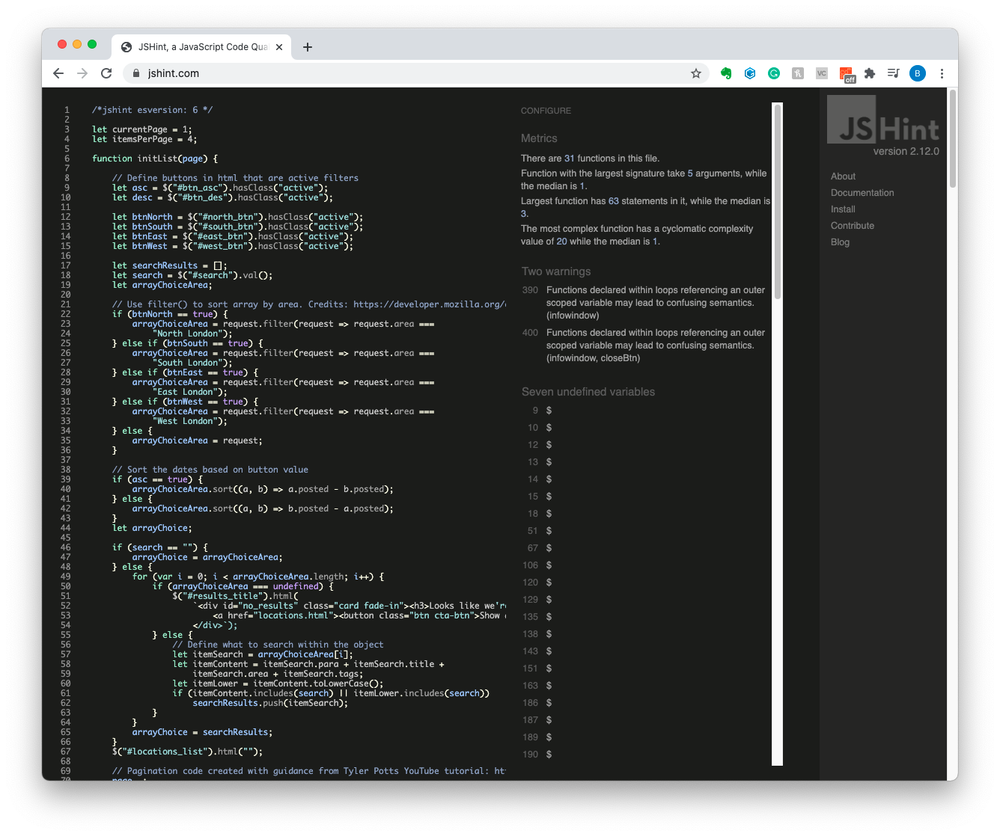
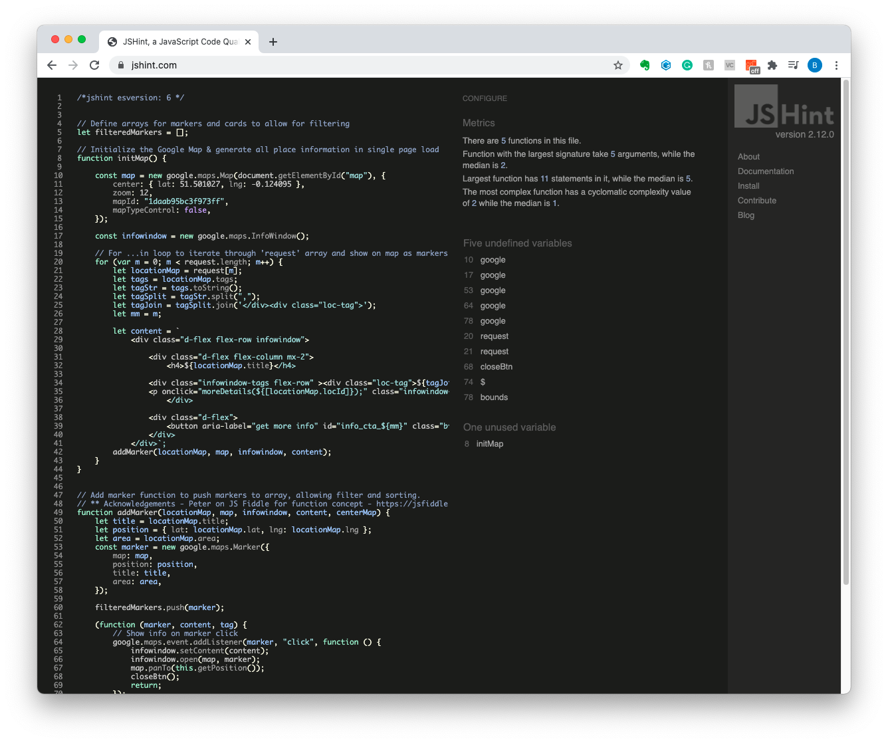
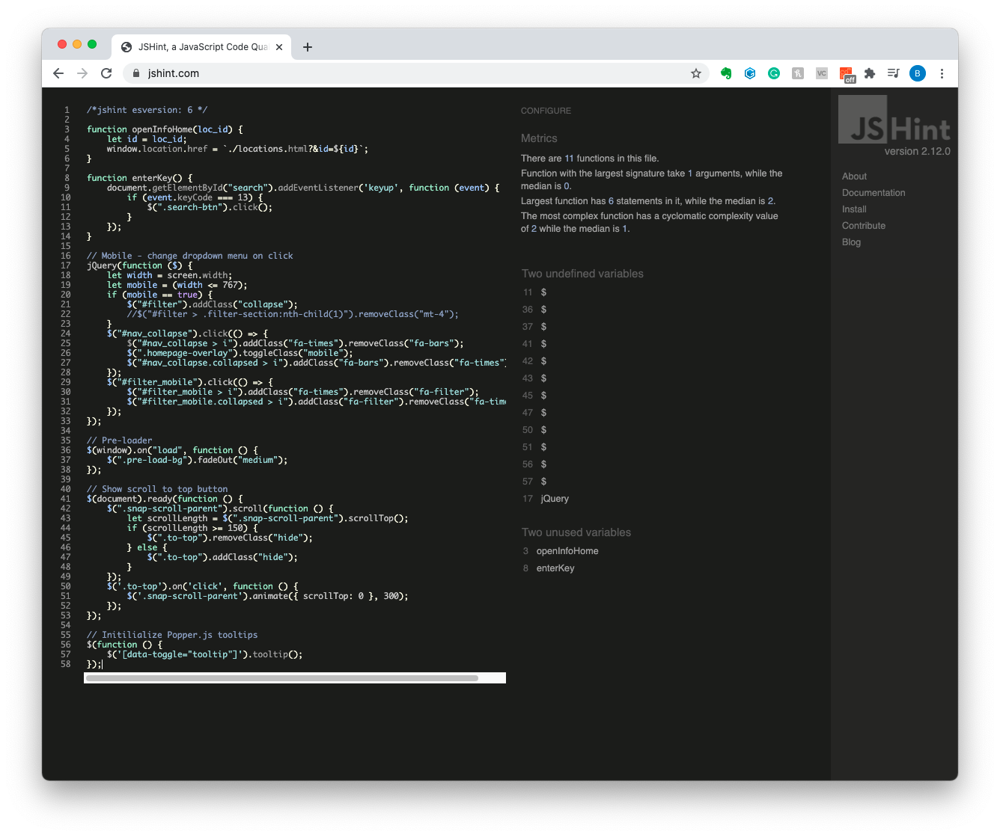

# Testing Documentation for Remote London

See below further information on the testing and results for the Remote London website. 

 

## Contents

- [JS Hint validation](#js-hint-javascript-validation)
- [Lighthouse Testing](#lighthouse-testing)
- [Responsivenss](#responsiveness)
- [Browser Compatibility](#browser-compatibility)
- [Accessibility](#accessibility)
- [Fixed Bugs](#fixed-bugs)
- [Known Bugs](#known-bugs)

---

 

### **JS Hint Javascript Validation**
 - With the exception of location_listing.js, all files return common errors as expected when submitted without context. For example:
        - $ symbol is undefined because jquery is not present in the validation.
        - initMap in google_maps_init.js is flagged as an unused variable as it is only called when the DOM is loaded via a callback.
    - Location_listing.js returns the above unavoidable jquery errors, but also flags two instances where the Google object event listener is called within a for each loop  - this is required in this structure in order to successfully filter the map markers and update the infowindow on 'click' of the respective marker. 
    - See below screenshots for full results:
        - location_listing.js

        

        - google_maps_init.js
        
        
        
        - main.js 

        

 

### **Lighthouse Testing**
> add lighthouse testing screens

 

### **Responsiveness**
Remote London is fully responsive on all device sizes. Using the Bootstrap breakpoints as the primary differentiator, the key differences are outlined below:
- Hamburger menu on navigation:
    - On mobile, the default navigation menu items are hidden by default, and revealed upon the click on the hamburger nav icon. 
    - Clicking the icon smoothly pushes the remainder of the page down and reveals the menu items. This ensures the users do not have to scroll more than necessary to get to the content of the page and thus improves useability.
    - On tablet and desktop, the nav items are clearly located at the top right of the page, where users are accustomed to seeing navigation menus.
    
     
     
     
    

- Filter section on locations.html page:
    - On mobile, the filter section is collapsed by default using the Bootstrap 'collapse' class and data-toggle.
    - The filter is easily opened by clicking the filter icon or header 'filter'. Having the entire header act as the trigger ensures that the area required to click is larger, and improves useability for users on small mobile devices.
    - With the filter built to be collapsable, this also ensures that the user does not have to uneccessarily scroll to view the listings - they can simply close the filter and quickly see the first result. 
    - On screen sizes medium and above, the filter section is positioned as a sidebar on the page, which reduces the need for the user to scroll, when the screen is wide enough to show both the filter section and the listings with ease.
     
    
     

- More information sidebar on locations.html page:
    - On mobile devices, clicking the 'read more' call-to-action on an listing item will open the more info sidebar full screen, to ensure content is easily readable and as much of the screen real-estate is used, preventing uneccessary scrolling by the user.
    - On tablet devices, the more info sidebar opens as a modal in the center of the screen. The section doesn't require the full height and width of the screen here, but having the sidebar on the right of the page as with desktop, would add unnecessary scrolling for the user to view all of the contents. 
    - On larger screens, the more info sidebar opens as a sidebar from the right, with a dark content overlay over the rest of the page. As with the modal on tablet, the darker background focusses user attention to the new content on the page. 
     
    
     

- Map view on locations.html page:
    - To improve useability on all devices, the map view resizes the map div to the width and height of the screen. 
    - On mobile, the map is set to 100vh and width 100% to ensure the entire map can be visible without the need for page scroll.
    - On tablet and above, the same is true - generating a much wider map, using as much screen real-estate as possible, increasing the area in which users can scroll and use the map functionality.
     
    
     

 

### **Browser Compatibility**
- Remote London has been testing on Firefox on desktop, as well as Chrome and Safari on desktop and mobile.
- Whilst minor styling incompatabilities were discovered (min-width of images and max-content vs fit-content widths), these have now been corrected and Chrome, Safari and Firefox browsers now render an equal experience for users, as shown by the screenshots below:
    - Chrome:

        
        
        

    - Safari:

        
        
        

    - Firefox:   

        
        
        

 

### **Accessibility**
Whilst the website has been optimised to nearly 100% accessibility rating on both [Google Lighthouse](https://developers.google.com/web/tools/lighthouse) and [WAVE Accessibility Evaluation Tool](https://wave.webaim.org/), there are a few minor warnings that are thrown in both of these tools that have been mitigated where possible:
- Missing alt text for the Google Map image tiles that are generated. This is unavoidable, as the tiles are generated from the the Google API call and cannot be altered. However to mitigate this, the map view button and map div have been given an 'aria-hidden' parameter of 'true', to ensure that users who require accessibility functions on their device, are not presented with an option that they could not use.
- Low contrast between the orange background and white text errors initially presented from the accessibility testing has resulted in the colour scheme being updated slightly. Instead of the lighter, pastel colours in the initial version, darker background elements have been introduced. 

### **Fixed Bugs**
- Google API & Location listing (google_maps_init.js & location_listing.js)
    - Items not filtering by date order 
        - Since the code is written to only pull the data from Google on the initial page load, to increase site performance and reduce data quota, a second Object array is now created after the Google data is pulled.
        - The 'listingObjectsCombined' array combines the listing content, posted date and location to allow for text based search and filtering of date and location based on an active button, with content already existing within the DOM.
        - Following a code review during testing in the final stage of this project, the code was further refactored to use the filter() method to sort Objects using an if/else statement when a button is active, vs a previous structure that created a new array for each area of London ('listingObjectNorth' ... etc).
    - Pagination causing array to sort and filter for only the items shown within that page tab, not based on whole dataset.
        - The initial build was structured prior to the pagination implementation, resulting in the slice() method and subsequent sort() method applied to the array to determine which listings to show on each page, sorting the objects only on the current for loop (i.e Objects 4, 5, 6 were sorted by date, but not 1 - 6). 
        - This bug was fixed by creating a function flow in initList() that each time a sort or filter button was toggled, would clear the previous listings and work through the function to check the criteria based on which buttons were 'active', and unhide the corresponding listing. 
        - Since the data is already pulled from Google and pushed to a new Object array on initial page load, this function now simply hides or unhides listings already loaded into the DOM, making the response time instant.
        - After lots of research on the most effective way to implement this, it was [Tyler Potts](https://www.youtube.com/channel/UCBBGM84ZOs7z5jpTQAaZ_Hg) on YouTube that provided the tutorial that allowed me to fix the above. The pagination tutorial [can be found here](https://www.youtube.com/watch?v=IqYiVHrO2U8).
    - Frequent Google API http request errors on random page loaded
        - This bug caused the 'content' variable within 'initMap()' function to return undefined which resulted in only partial or no return of places data from Google.
        - The error was tested repeatedly whilst changing the script load orders as well as applying async and defer, but the pattern still appeared randomised.
        - After narrowing down the issue to possibly being a result of an inconsistent load time on the Google request, causing location_listing.js to attempt to call data from a script that had not yet run, I decided to use jQuery to append the last script to the <head> tag only after the page had loaded (the answers on [this StackOverflow thread](https://stackoverflow.com/questions/19737031/loading-scripts-after-page-load) guided me on this). 
        - Whilst loading location_listing.js only after the page had loaded helped with the issue, it was still occuring intermittently. Throught further testing, I discovered that the issue is likely caused but the Google API request attempting to run a callback function (initMap()) from a script that may not have loaded at that point. 
        - Having now positioned the Google API request at the bottom of the body, this appears to have dramatically improved this issue, as the initMap() function exists before the script attempts the Google request.
        - Whilst the above fix mitigated this bug the majority of the time, I decided to refactor the code, to now pull the initial data from the 'request' dataset within the codebase, then only call the Google API when 'more details' is clicked. By doing this, the user is only requesting Google information on one result only, making the response time quicker, and ensuring that data will always show.
    - Jumping / flickering of page structure on page load caused by jQuery append() adding items to existing divs that load at different times.
        - This was an expected issue when using javascript to manipulate the HTML on the page, since the scripts would load at different speeds to the HTML in the page. 
        - To fix this issue and improve user experience, I added a loading screen animation with the CSS transform property to continuously run until the full page is loaded where javascript is altering the HTML (index.html and locations.html).
    - Map and list overlay when opening sidebar would remain / disappear early if too many clicks
        - The overlays that appear behind the 'more info' sidebar would frequently become out of sync with the sidebar as their styles were adjusted independently from one another.
        - I have since refactored the code and used jQuery's existing fadeOut() method to show and hide a page-wide overlay, which functions much smoother.
    - Safari would not load initMap in Google callback in script load order specified, resulting in empty dataset
        - In refactoring the code to only request the Google data when the user clicks 'more details', this ensures that the callback function in the Google API is not required to successfully show the initial listing data.
    > rewrite above

- Deployment & Site-wide
    - Footer not sticking to bottom of page when content height in body is less than 100vh
        - The bug was first discovered on the 'About Us' supporting page, whereby only a small paragraph of text existed, the footer would sit at the bottom of the last div.
        - This has now been remedied by creating a footer-wrapper, to which the footer tag can have an absolute position, relative to the wrapper.
        - The wrapper is then set to have a min-height of the footer, and a margin-top of auto to push the wrapper to the bottom of the body (which has a min-height of 100vh))
    - Broken image file path when deploying to GitHub Pages
        - This bug has been quickly fixed by correcting the extra '.' in the root file path in links. Images now direct to './' not '../' which has resolved the issue.
    - Search function on homepage header returns 404 instead of locations page
        - This has now been fixed, again this was due to an incorrect file path when deploying to GitHub Pages.
        - Since I was using window.location.href to set the new path, it was not including the host to the URL string (removing 'MS2-remoteworking-london'), which would return an invalid URL.
        - This bug was fixed with the help of [this article at CSS Tricks](https://css-tricks.com/snippets/javascript/get-url-and-url-parts-in-javascript/)
    - Click to scroll to top button not functioning
        - After many iterations of code to create scroll to top function using jQuery, I discovered through [this thread in StackOverflow](https://stackoverflow.com/questions/1144805/scroll-to-the-top-of-the-page-using-javascript), that the DOM must be loaded before the jQuery scrollTop() method will work. 

### **Known Bugs**
- Currently there is an existing limitation present on the site caused by pulling data from the Google Places API. If a user makes too many requests in a single session, the request will return no, or only partial results. Whilst a fix is being researched, this appears to be a Google quota limitation to avoid overloading the server with requests.
- Images on listings show alt for a few seconds when pulling data.
- On 'more details' trigger on map view, the initMap function reloads the map, making it dissappear for a few seconds
> re-write below
